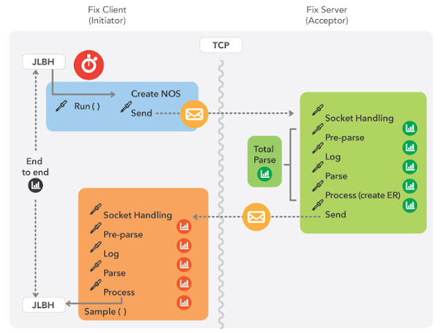

JLBH - 引入 Java 延迟基准测试工具
# 翻译并且更新了代码依赖
[JLBH - Introducing Java Latency Benchmarking Harness](http://www.rationaljava.com/2016/04/jlbh-introducing-java-latency.html)

在这篇文章中：
* [什么是JLBH](#什么是-jlbh-)
* [我们为什么要写 JLBH](#我们为什么写-jlbh)
* [JMH 和 JLBH 的区别](#jmh-和-jlbh-之间的区别)
* [快速入门指南](#快速入门指南)

## 什么是 JLBH？ 

JLBH 是一种可用于测量 Java 程序延迟的工具。它具有以下特点：

* 旨在运行比微基准测试更大的代码。
* 适用于使用异步活动的程序，如生产者消费者模式。
* 能够对程序中的各个点进行基准测试
* 能够将吞吐量调整为基准
* 调整协调遗漏，即迭代的端到端延迟如果备份会相互影响
* 报告并运行自己的抖动线程

## 我们为什么写 JLBH？

编写 JLBH 是因为我们需要一种对 Chronicle-FIX 进行基准测试的方法。我们创建它是为了对我们软件中的问题进行基准测试和诊断。它被证明非常有用，现在可以在 Chronicle 开源库中使用。

Chronicle-FIX 是一个超低延迟的 Java 修复引擎。它保证延迟，例如，将 NewOrderSingle 消息解析到对象模型的时间不会超过 6us，直到第 99.9 个百分位数。事实上，我们需要沿着百分位范围一直测量。 这是延迟/百分位数的典型配置文件。

50 -> 1.5us
90 -> 2us
99 -> 2us
99.9 -> 6us
99.99 -> 12us
99.999 -> 35us
最差 -> 500us

Chronicle Fix 通过从 10k 消息/秒到 100k 消息/秒的各种吞吐量来保证这些延迟。
因此，我们需要一个可以轻松改变吞吐量的测试工具。我们还需要考虑协调遗漏。
换句话说，我们不能忽略慢速运行对后续运行的影响。如果运行 A 很慢，导致运行 B 延迟，
即使运行 B 在其自身运行中没有延迟，仍然必须记录延迟的事实。

我们需要尝试区分操作系统抖动、JVM 抖动和我们自己的代码引起的抖动。出于这个原因，我们添加了一个抖动线程选项，
该线程除了在 JVM 中采样抖动外什么都不做。这将显示操作系统抖动的组合，例如线程调度和一般操作系统中断以及全局 JVM 事件，
例如 GC 暂停。  我们需要尽可能将延迟归因于单个例程甚至代码行，因此我们还创造了将自定义采样添加到程序中的可能性。
NanoSamplers 的添加为基准测试增加了很少的开销，并允许您观察程序在何处引入延迟。

这是我们构建的用于衡量 Chronicle-FIX 的基准的示意图。

我们最终得到如下结果：这是典型的运行：

    Run time: 100.001s
    Correcting for co-ordinated:true
    Target throughput:50000/s = 1 message every 20us
    End to End: (5,000,000)                         50/90 99/99.9 99.99/99.999 - worst was 11 / 15  17 / 20  121 / 385 - 541
    Acceptor:1 init2AcceptNetwork (4,998,804)       50/90 99/99.9 99.99/99.999 - worst was 9.0 / 13  15 / 17  21 / 96 - 541
    Acceptor:1.1 init2AcceptorNetwork(M) (1,196)    50/90 99/99.9 99.99 - worst was 22 / 113  385 / 401  401 - 401
    Acceptor:2 socket->parse (4,998,875)            50/90 99/99.9 99.99/99.999 - worst was 0.078 / 0.090  0.11 / 0.17  1.8 / 2.1 - 13
    Acceptor:2.0 remaining after read (20,649,126)  50/90 99/99.9 99.99/99.999 99.9999/worst was 0.001 / 0.001  0.001 / 0.001  0.001 / 1,800  3,600 / 4,590
    Acceptor:2.1 parse initial (5,000,100)          50/90 99/99.9 99.99/99.999 - worst was 0.057 / 0.061  0.074 / 0.094  1.0 / 1.9 - 4.7
    Acceptor:2.5 write To Queue (5,000,100)         50/90 99/99.9 99.99/99.999 - worst was 0.39 / 0.49  0.69 / 2.1  2.5 / 3.4 - 418
    Acceptor:2.9 end of inital parse (5,000,000)    50/90 99/99.9 99.99/99.999 - worst was 0.17 / 0.20  0.22 / 0.91  2.0 / 2.2 - 7.6
    Acceptor:2.95 on mid (5,000,000)                50/90 99/99.9 99.99/99.999 - worst was 0.086 / 0.10  0.11 / 0.13  1.4 / 2.0 - 84
    Acceptor:3 parse NOS (5,000,000)                50/90 99/99.9 99.99/99.999 - worst was 0.33 / 0.38  0.41 / 2.0  2.2 / 2.6 - 5.5
    Acceptor:3.5 total parse (5,000,000)            50/90 99/99.9 99.99/99.999 - worst was 1.1 / 1.2  1.8 / 3.0  3.5 / 5.8 - 418
    Acceptor:3.6 time on server (4,998,804)         50/90 99/99.9 99.99/99.999 - worst was 1.1 / 1.2  1.8 / 3.1  3.8 / 6.0 - 418
    Acceptor:4 NOS processed (5,000,000)            50/90 99/99.9 99.99/99.999 - worst was 0.21 / 0.23  0.34 / 1.9  2.1 / 2.8 - 121
    Jitter (5,000,000)                              50/90 99/99.9 99.99/99.999 - worst was 0.035 / 0.035  0.035 / 0.037  0.75 / 1.1 - 3.3
    OS Jitter (108,141)                             50/90 99/99.9 99.99 - worst was 1.2 / 1.4  2.5 / 4.5  209 - 217

在基准测试结束时，所有样本都在运行中进行了总结，这里是一对：

-------------------------------- SUMMARY (Acceptor:2.95 on mid)----------------------

| Percentile |    run1 |    run2 |    run3 |  run4 |     run5 |  % Variation |  var(log) |
|------------|---------|---------|---------|-------|----------|--------------|-----------|
| 50:00:00   | 0.09    | 0.09    | 0.09    | 0.09  | 0.09     | 0            | 3.32      |
| 90:00:00   | 0.1     | 0.1     | 0.1     | 0.1   | 0.1      | 0            | 3.58      |
| 99:00:00   | 0.11    | 0.11    | 0.11    | 0.11  | 0.11     | 2.45         | 3.69      |
| 99.9:      | 0.13    | 0.13    | 0.62    | 0.78  | 0.13     | 76.71        | 6.01      |
| 99.99:     | 1.5     | 1.38    | 1.82    | 1.89  | 1.7      | 19.88        | 9.3       |
| worst:     | 1.95    | 2.02    | 2.11    | 2.24  | 2.24     | 6.9          | 9.9       |
-------------------------------------------------------------------------------------
-------------------------------- SUMMARY (Acceptor:3 parse NOS)----------------------

| Percentile | run1 | run2 | run3 | run4 | run5 | % Variation | var(log) |
|------------|------|------|------|------|------|-------------|----------|
| 50:        | 0.33 | 0.33 | 0.34 | 0.36 | 0.36 | 6.11        | 5.75     |
| 90:        | 0.38 | 0.38 | 0.46 | 0.46 | 0.46 | 12.42       | 6.24     |
| 99:        | 0.41 | 0.41 | 0.50 | 0.53 | 0.50 | 16.39       | 6.47     |
| 99.9:      | 2.11 | 2.02 | 2.11 | 2.11 | 2.11 | 3.08        | 9.76     |
| 99.99:     | 2.37 | 2.24 | 2.37 | 2.37 | 2.37 | 3.67        | 10.05    |
| worst:     | 2.88 | 2.62 | 3.14 | 3.14 | 2.88 | 11.51       | 10.67    |

-------------------------------------------------------------------------------------

使用 JLBH 我们能够根据标准中的标准对我们的应用程序进行基准测试规范以及诊断一些延迟峰值。

通过改变基准测试的吞吐量和运行时间，尤其是通过向代码模式中的各个点添加采样，开始出现这将我们引向延迟的根源。
这方面的一个具体示例是DateTimeFormatter 封装 TLB 缓存未命中的问题，但这将是另一篇文章的主题。

## JMH 和 JLBH 之间的区别

我希望大多数阅读本文的人都熟悉JMH

（Java MicroBenchmarking Harness），这是一个用于微基准测试的优秀工具，
如果您还没有使用过它，那么它是每个 Java 开发人员都应该拥有的一个有价值的工具。
特别是那些与测量延迟有关的人。正如您将从 JLBH 设计中看到的那样，它的大部分灵感来自 JMH。
那么，如果 JMH 如此出色，为什么我们必须创建另一个基准线束？ 我想在高层次上答案就在名字中。
J M H 直接针对微型基准测试，而 JLBH 则用于查找大型程序中的延迟。但不仅如此。
阅读上一节后，您会发现对于某类问题，您可能出于多种原因希望选择 JLBH 而不是 JMH。

顺便说一句，尽管您始终可以使用 JLBH 而不是 JMH，但如果您有一个真正的微型基准测试，并且希望尽可能干净、
准确地进行测量，我总是建议您使用 JMH 而不是 JLBH。JMH 是一个极其复杂的工具，
它确实做得很好，例如 JMH 为每次运行分叉 JVM，而目前 JLBH 还没有。   

当您使用 JLBH 而不是 JMH 时：

 * 如果你想看到你的代码在上下文中运行。  （请参阅JLBH 示例 1 - 为什么应在上下文中对代码进行基准测试，以通过示例全面处理此概念。）
JMH 的本质是对您的代码进行非常小的采样，假设在 FIX 引擎的情况下只是解析，并将其隔离计时。
在我们的测试中，完全相同的修复解析在上下文中运行时占用了两倍的时间，即作为修复引擎的一部分，就像它们在上下文外运行时所做的那样，即在微基准测试中。我在延迟示例项目DateSerialise中有一个很好的例子，我在其中演示了序列化Date在 TCP 调用中运行时，对象可能需要两倍的时间。这样做的原因全都与 CPU 缓存有关，我们将在以后的博客中返回。
* 如果要考虑协调遗漏。  在 JMH 中，根据设计，所有迭代都是相互独立的，因此如果代码的一次迭代很慢，它不会影响下一次迭代。我们可以在我的延迟示例SimpleSpike中看到这方面的一个很好的例子，我们在其中看到了考虑协调遗漏可能产生的巨大影响。在考虑协调遗漏时，几乎总是应该衡量真实世界的例子。
例如，假设您正在等火车，但由于前面的火车晚点而在车站耽误了一个小时。然后让我们想象一下，你上火车晚了一个小时，而火车通常需要半个小时才能到达目的地。如果您不考虑协调遗漏，您将不会认为自己遭受了任何延误，因为即使您在出发前在车站等了一个小时，您的旅程也花费了正确的时间！
* 如果您想改变测试的吞吐量。JLBH 允许您将吞吐量设置为基准的参数。
事实上，如果没有定义的吞吐量，延迟就毫无意义，因此能够在延迟配置文件中看到不同吞吐量的结果非常重要。
JMH 不允许您设置吞吐量。（事实上​​，这与 JMH 不考虑协调遗漏的事实密切相关。）
* 您希望能够对代码中的各个点进行采样。  端到端的延迟作为一个开始是很好的，但是然后呢？您需要能够记录代码中许多点的延迟配置文件。使用 JLBH，您可以在您选择的任何位置将探测器添加到您的代码中，而对程序的开销非常小。JMH 的设计使您只能从方法的开始 ( @Benchmark ) 到结束进行测量。
* 您想要测量操作系统和 JVM 全局延迟。JLBH 运行一个单独的抖动线程。这与您的程序并行运行，除了通过重复调用System.nanoTime()来采样延迟之外什么都不做。虽然这本身并不能告诉您太多，但它可以指示基准测试期间您的 JVM 端发生了什么。此外，您可以添加一个不执行任何操作的探测器（这将在稍后解释），您可以在其中对运行您正在进行基准测试的代码的线程内的延迟进行采样。JMH 没有这种功能。

正如我之前提到的，如果您不想使用这些功能中的一项或多项，那么选择 JMH 而不是 JLBH。

## 快速入门指南

*JLBH* 的代码可以在 Chronicle-Core 库中找到，该库可以在 GitHub 上[找到](https://github.com/OpenHFT/JLBH)。

要从 [Maven-Central](https://mvnrepository.com/artifact/net.openhft/jlbh) 下载，请将其包含在您的 pom.xml 中（检查最新版本）：

        <!-- https://mvnrepository.com/artifact/net.openhft/jlbh -->
        <dependency>
            <groupId>net.openhft</groupId>
            <artifactId>jlbh</artifactId>
            <version>1.23ea2</version>
            <scope>test</scope>
        </dependency>
         https://mvnrepository.com/artifact/net.openhft/chronicle-core 
        <dependency>
            <groupId>net.openhft</groupId>
            <artifactId>chronicle-core</artifactId>
            <version>2.24ea6</version>
        </dependency>

要编写基准测试，您已经实现了 *JLBHTask* 接口：

它只有两个你需要实现的方法：
* *init(JLBH jlbh)* 您将获得对 JLBH 的引用，您需要在基准测试完成后  回调 ( *jlbh.sampleNanos()* )。
* *run(long startTime)* 每次迭代运行的代码。当您计算基准测试花费了多长时间并回调 *jlbh.sampleNanos()* 时，您将需要保留开始时间。
   *JLBH* 计算调用 *sampleNanos()* 的次数，它必须与调用 *run()* 的次数完全匹配。对于您可以创建的其他探测器，情况并非如此。

* 第三种可选方法 *complete()* 可能对某些基准的清理很有用。

所有这一切都可以在一个简单的例子中得到最好的体现：在这种情况下，我们测量将一个项目放入 

*ArrayBlockingQueue* 并再次将其取下所花费的时间。我们添加探测器以查看对 *put()* 和 *poll()* 的调用需要多长时间。

我鼓励您运行这个不同的吞吐量和 *ArrayBlockingQueue* 的大小，看看它有什么不同。 

如果将 *accountForCoordinatedOmission* 设置为 *true* 或 *false* ，您还可以看到它所产生的差异。

'''

    package org.latency.prodcon;
    
    import net.openhft.chronicle.core.jlbh.JLBH;
    import net.openhft.chronicle.core.jlbh.JLBHOptions;
    import net.openhft.chronicle.core.jlbh.JLBHTask;
    import net.openhft.chronicle.core.util.NanoSampler;
    
    import java.util.concurrent.*;
    
    /**
    * Simple test to demonstrate how to use JLBH
      */
      public class ProducerConsumerJLBHTask implements JLBHTask {
    
      private final BlockingQueue<Long> queue = new ArrayBlockingQueue(2);
    
      private NanoSampler putSampler;
      private NanoSampler pollSampler;
      private volatile boolean completed;

        public static void main(String[] args){
            //Create the JLBH options you require for the benchmark
            JLBHOptions lth = new JLBHOptions()
                    .warmUpIterations(40_000)
                    .iterations(100_000)
                    .throughput(40_000)
                    .runs(3)
                    .recordOSJitter(true)
                    .accountForCoordinatedOmmission(true)
                    .jlbhTask(new ProducerConsumerJLBHTask());
            new JLBH(lth).start();
        }
    
        @Override
        public void run(long startTimeNS) {
            try {
                long putSamplerStart = System.nanoTime();
                queue.put(startTimeNS);
                putSampler.sampleNanos(System.nanoTime() - putSamplerStart);
            } catch (InterruptedException e) {
                e.printStackTrace();
            }
        }
    
        @Override
        public void init(JLBH lth) {
            putSampler = lth.addProbe("put operation");
            pollSampler = lth.addProbe("poll operation");
    
            ExecutorService executorService = Executors.newSingleThreadExecutor();
            executorService.submit(()->{
                while(!completed) {
                    long pollSamplerStart = System.nanoTime();
                    Long iterationStart = queue.poll(1, TimeUnit.SECONDS);
                    pollSampler.sampleNanos(System.nanoTime() - pollSamplerStart);
                    //call back JLBH to signify that the iteration has ended 
                    lth.sample(System.nanoTime() - iterationStart);
                }
                return null;
            });
            executorService.shutdown();
        }
    
        @Override
        public void complete(){
            completed = true;
        }
     }    

'''

查看[JLBHOptions](https://github.com/OpenHFT/JLBH/blob/ea/src/main/java/net/openhft/chronicle/jlbh/JLBHOptions.java)中包含的所有可用于设置 JLBH 基准的选项。
在下一篇文章中，我们将查看更多 JLBH 基准测试示例。如果您对 JLBH 有任何反馈，
请告诉我 - 如果您想贡献，请随时分叉 Chronicle-Core 并发出拉取请求！

