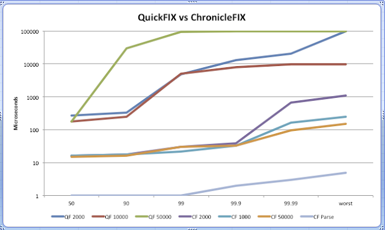

# JLBH 示例 4 - QuickFix 与 ChronicleFix 的基准测试
[JLBH Examples 4 - Benchmarking QuickFix vs ChronicleFix](http://www.rationaljava.com/2016/04/jlbh-examples-4-benchmarking-quickfix.html)

在这篇文章中：

* [使用 JLBH 测试 QuickFIX]()
* [观察 QuickFix 延迟如何通过百分位数降低]()
* [比较 QuickFIX 和 Chronicle FIX]()

如[JLBH 简介](Intro.md)中所述，创建 JLBH 的主要原因是测量 Chronicle-FIX 引擎。我们使用 JLBH 的所有功能，特别是吞吐量杠杆和协调遗漏的计算，以获得 QuickFIX 的一些实际时间。在本文的后面，我们将查看 ChronicleFIX 的一些结果，
但首先让我们看看对 QuickFix 进行基准测试，这是一个修复引擎的开源实现。 这是我们将要进行基准测试的场景：

* 客户端创建一个 NewOrderSingle，然后将其传递给服务器。  
* 服务器解析 NewOrderSingle
* 服务器创建一个发送回客户端的 ExecutionReport。
* 客户端收到ExecutionReport
* 
端到端时间是指从客户端开始创建 NewOrderSingle 到客户端收到 ExecutionReport 的时间。 注意：我们需要保持程序调用基准测试的开始时间。为此，我们使用了一个技巧并将开始时间设置为标签 ClOrdId。如果你想让基准测试在你的服务器上运行，
你应该克隆这个 [GitHub 存储库](https://github.com/danielshaya/LatencyTasks)，所有的 jar 和配置文件都在那里设置。为了这篇文章，这里是基准代码。

'''

        package org.latency.quickfix;
        
        import net.openhft.chronicle.core.Jvm;
        import net.openhft.chronicle.core.jlbh.JLBHOptions;
        import net.openhft.chronicle.core.jlbh.JLBHTask;
        import net.openhft.chronicle.core.jlbh.JLBH;
        import quickfix.*;
        import quickfix.field.*;
        import quickfix.fix42.ExecutionReport;
        import quickfix.fix42.NewOrderSingle;
        
        import java.util.Date;
        import java.util.concurrent.Executors;
        
        /**
        * Created by daniel on 19/02/2016.
          * Latency task to test sending a message in QuickFix
            */
            public class QFJLBHTask implements JLBHTask {
        
        
            private QFClient client;
            private JLBH lth;
            private static NewOrderSingle newOrderSingle;
            private static ExecutionReport executionReport;
        
            public static void main(String[] args) {
                executionReport = new ExecutionReport();
                executionReport.set(new AvgPx(110.11));
                executionReport.set(new CumQty(7));
                executionReport.set(new ClientID("TEST"));
                executionReport.set(new ExecID("tkacct.151124.e.EFX.122.6"));
                executionReport.set(new OrderID("tkacct.151124.e.EFX.122.6"));
                executionReport.set(new Side('1'));
                executionReport.set(new Symbol("EFX"));
                executionReport.set(new ExecType('2'));
                executionReport.set(new ExecTransType('0'));
                executionReport.set(new OrdStatus('0'));
                executionReport.set(new LeavesQty(0));
        
                newOrderSingle = new NewOrderSingle();
        
                newOrderSingle.set(new OrdType('2'));
                newOrderSingle.set(new Side('1'));
                newOrderSingle.set(new Symbol("LCOM1"));
                newOrderSingle.set(new HandlInst('3'));
                newOrderSingle.set(new TransactTime(new Date()));
                newOrderSingle.set(new OrderQty(1));
                newOrderSingle.set(new Price(200.0));
                newOrderSingle.set(new TimeInForce('0'));
                newOrderSingle.set(new MaturityMonthYear("201106"));
                newOrderSingle.set(new SecurityType("FUT"));
                newOrderSingle.set(new IDSource("5"));
                newOrderSingle.set(new SecurityID("LCOM1"));
                newOrderSingle.set(new Account("ABCTEST1"));
        
                JLBHOptions jlbhOptions = new JLBHOptions()
                        .warmUpIterations(20_000)
                        .iterations(10_000)
                        .throughput(2_000)
                        .runs(3)
                        .accountForCoordinatedOmmission(false)
                        .jlbhTask(new QFJLBHTask());
                new JLBH(jlbhOptions).start();
            }
        
            @Override
            public void init(JLBH lth) {
                this.lth = lth;
                Executors.newSingleThreadExecutor().submit(() ->
                {
                    QFServer server = new QFServer();
                    server.start();
                });
                Jvm.pause(3000);
                client = new QFClient();
                client.start();
            }
        
            @Override
            public void complete() {
                System.exit(0);
            }
        
            @Override
            public void run(long startTimeNs) {
                newOrderSingle.set(new ClOrdID(Long.toString(startTimeNs)));
                try {
                    Session.sendToTarget(newOrderSingle, client.sessionId);
                } catch (SessionNotFound sessionNotFound) {
                    sessionNotFound.printStackTrace();
                }
            }
        
            private class QFServer implements Application {
                void start() {
                    SocketAcceptor socketAcceptor;
                    try {
                        SessionSettings executorSettings = new SessionSettings(
                                "src/main/resources/acceptorSettings.txt");
                        FileStoreFactory fileStoreFactory = new FileStoreFactory(
                                executorSettings);
                        MessageFactory messageFactory = new DefaultMessageFactory();
                        FileLogFactory fileLogFactory = new FileLogFactory(executorSettings);
                        socketAcceptor = new SocketAcceptor(this, fileStoreFactory,
                                executorSettings, fileLogFactory, messageFactory);
                        socketAcceptor.start();
                    } catch (ConfigError e) {
                        e.printStackTrace();
                    }
                }
        
                @Override
                public void onCreate(SessionID sessionId) {
                }
        
        
                @Override
                public void onLogon(SessionID sessionId) {
                }
        
        
                @Override
                public void onLogout(SessionID sessionId) {
                }
        
        
                @Override
                public void toAdmin(Message message, SessionID sessionId) {
                }
        
        
                @Override
                public void fromAdmin(Message message, SessionID sessionId)
                        throws FieldNotFound, IncorrectDataFormat, IncorrectTagValue,
                        RejectLogon {
                }
        
        
                @Override
                public void toApp(Message message, SessionID sessionId) throws DoNotSend {
                }
        
        
                @Override
                public void fromApp(Message message, SessionID sessionId)
                        throws FieldNotFound, IncorrectDataFormat, IncorrectTagValue,
                        UnsupportedMessageType {
                    try {
                        executionReport.set(((NewOrderSingle) message).getClOrdID());
                        Session.sendToTarget(executionReport, sessionId);
                    } catch (SessionNotFound invalidMessage) {
                        invalidMessage.printStackTrace();
                    }
                }
            }
        
            private class QFClient implements Application {
                private SessionID sessionId = null;
        
                void start() {
                    SocketInitiator socketInitiator;
                    try {
                        SessionSettings sessionSettings = new SessionSettings("src/main/resources/initiatorSettings.txt");
                        FileStoreFactory fileStoreFactory = new FileStoreFactory(sessionSettings);
                        FileLogFactory logFactory = new FileLogFactory(sessionSettings);
                        MessageFactory messageFactory = new DefaultMessageFactory();
                        socketInitiator = new SocketInitiator(this,
                                fileStoreFactory, sessionSettings, logFactory,
                                messageFactory);
                        socketInitiator.start();
                        sessionId = socketInitiator.getSessions().get(0);
                        Session.lookupSession(sessionId).logon();
                        while (!Session.lookupSession(sessionId).isLoggedOn()) {
                            Thread.sleep(100);
                        }
                    } catch (Throwable exp) {
                        exp.printStackTrace();
                    }
                }
        
                @Override
                public void fromAdmin(Message arg0, SessionID arg1) throws FieldNotFound,
                        IncorrectDataFormat, IncorrectTagValue, RejectLogon {
                }
        
        
                @Override
                public void fromApp(Message message, SessionID arg1) throws FieldNotFound,
                        IncorrectDataFormat, IncorrectTagValue, UnsupportedMessageType {
                    long startTime = Long.parseLong(((ExecutionReport) message).getClOrdID().getValue());
                    lth.sample(System.nanoTime() - startTime);
                }
        
                @Override
                public void onCreate(SessionID arg0) {
                }
        
                @Override
                public void onLogon(SessionID arg0) {
                    System.out.println("Successfully logged on for sessionId : " + arg0);
                }
        
                @Override
                public void onLogout(SessionID arg0) {
                    System.out.println("Successfully logged out for sessionId : " + arg0);
                }
        
                @Override
                public void toAdmin(Message message, SessionID sessionId) {
                    boolean result;
                    try {
                        result = MsgType.LOGON.equals(message.getHeader().getField(new MsgType()).getValue());
                    } catch (FieldNotFound e) {
                        result = false;
                    }
                    if (result) {
                        ResetSeqNumFlag resetSeqNumFlag = new ResetSeqNumFlag();
                        resetSeqNumFlag.setValue(true);
                        ((quickfix.fix42.Logon) message).set(resetSeqNumFlag);
                    }
                }
        
                @Override
                public void toApp(Message arg0, SessionID arg1) throws DoNotSend {
                }
        
            }
        }

'''

这些是我在我的服务器 Intel(R) Xeon(R) CPU E5-2650 v2 @ 2.60GHz 上运行时看到的结果 。吞吐量为 2,000/s

| Percentil | run1      | run2     | run3      | % Variation |
|-----------|-----------|----------|-----------|-------------|
| 50:       | 270.34    | 270.34   | 233.47    | 9.52        |
| 90:       | 352.26    | 335.87   | 1867.78   | 75.25       |
| 99:       | 6684.67   | 4849.66  | 69206.02  | 89.84       |
| 99.9:     | 13369.34  | 12845.06 | 163577.86 | 88.67       |
| 99.99:    | 81788.93  | 20447.23 | 163577.86 | 82.35       |
| worst:    | 111149.06 | 98566.14 | 163577.86 | 30.54       |

在 10,000/s 的吞吐量下

| Percentile | run1     | run2    | run3    | % Variation |
|------------|----------|---------|---------|-------------|
| 50:        | 184.32   | 176.13  | 176.13  | 0.00        |
| 90:        | 573.44   | 270.34  | 249.86  | 5.18        |
| 99:        | 19398.66 | 2686.98 | 5111.81 | 37.56       |
| 99.9:      | 28835.84 | 7733.25 | 7995.39 | 2.21        |
| 99.99:     | 30932.99 | 9699.33 | 9175.04 | 3.67        |
| worst:     | 30932.99 | 9699.33 | 9175.04 | 3.67        |

这里的平均值是 ~200us，但随着百分位的上升，延迟真的开始下降。这在很大程度上是由于产生了大量的垃圾！您可以通过使用 jvm 标志-verbosegc运行基准测试来看到这一点。

 ## 笔记

*10k/s 的延迟略好于 2k/s。这是相当违反直觉的，因为我们预计延迟会随着吞吐量的增加而增加，例如，当我们发现低于 50k 的运行时，延迟会更糟。对 10k / 2k 差异的解释是，随着吞吐量的增加，CPU 缓存和其他资源可能会保持更热，
因此，在某种程度上，延迟实际上会随着吞吐量的增加而变得更好。这也是为什么在应用程序的实际吞吐量下测量延迟如此重要的另一个原因。*

事实上，当您将吞吐量提高到 50,000/s 时，甚至您的第 90 个百分位数（每 10 次迭代中有 1 个）完全失效，
您最终会出现数毫秒的延迟。吞吐量 50,000/s

| Percentile | run1     | run2     | run3     | % Variation | var(log) |
|------------|----------|----------|----------|-------------|----------|
| 50:        | 176.13   | 176.13   | 176.13   | 0.00        | 11.82    |
| 90:        | 12845.06 | 29884.42 | 3604.48  | 82.94       | 21.01    |
| 99:        | 34603.01 | 94371.84 | 17301.50 | 74.81       | 25.26    |
| 99.9:      | 42991.62 | 98566.14 | 25690.11 | 65.41       | 25.84    |
| 99.99:     | 45088.77 | 98566.14 | 27787.26 | 62.94       | 25.93    |
| worst:     | 45088.77 | 98566.14 | 27787.26 | 62.94       | 25.93    |

这里的问题不仅仅是平均时间（假设 ~200us 对你来说太慢了），更令人担忧的是随着吞吐量的增加和你研究更高的百分位数，数字下降的方式。

让我们比较一下这个 Chronicle-FIX。测试针对完全相同的场景在同一台机器上运行。

结果如下所示：

在 2000/s 的吞吐量下

| Percentile | run1   | run2    | run3   | % Variation |
|------------|--------|---------|--------|-------------|
| 50:        | 16.90  | 16.90   | 16.90  | 0.00        |
| 90:        | 18.94  | 18.94   | 18.94  | 0.00        |
| 99:        | 26.11  | 30.21   | 23.04  | 17.18       |
| 99.9:      | 35.84  | 39.94   | 33.79  | 10.81       |
| 99.99:     | 540.67 | 671.74  | 401.41 | 65.41       |
| worst:     | 638.98 | 1081.34 | 606.21 | 61.59       |

在 10,000/s 的吞吐量下

| Percentile | run1    | run2   | run3   | % Variation |
|------------|---------|--------|--------|-------------|
| 50:        | 16.90   | 16.90  | 16.13  | 3.08        |
| 90:        | 18.94   | 18.94  | 18.94  | 0.00        |
| 99:        | 26.11   | 22.02  | 20.99  | 3.15        |
| 99.9:      | 88.06   | 33.79  | 83.97  | 49.75       |
| 99.99:     | 999.42  | 167.94 | 802.82 | 71.59       |
| worst:     | 1146.88 | 249.86 | 966.66 | 65.67       |

吞吐量 50,000/s

| Percentile | run1   | run2   | run3   | % Variation |
|------------|--------|--------|--------|-------------|
| 50:        | 15.62  | 15.10  | 15.62  | 2.21        |
|            |        |        |        |             |
| 90:        | 17.92  | 16.90  | 16.90  | 0.00        |
|            |        |        |        |             |
| 99:        | 22.02  | 30.21  | 29.18  | 2.29        |
|            |        |        |        |             |
| 99.9:      | 120.83 | 352.26 | 33.79  | 86.27       |
|            |        |        |        |             |
| 99.99:     | 335.87 | 802.82 | 96.26  | 83.03       |
|            |        |        |        |             |
| worst:     | 450.56 | 901.12 | 151.55 | 76.73       |

Chronicle-FIX 平均值约为 16us，比 QuickFIX 快 12 倍。

但不仅如此，因为几乎所有时间都在 TCP 往返中。当您测量 TCP 时间时（请参阅上一篇文章 JLBH 示例 3 - 吞吐量对延迟的影响），结果表明大部分时间是 TCP ~10us。

因此，如果你减去 TCP 时间，你会得到 

快速修复 200 - 10 = 190

编年史-FIX 16 - 10 = 6

Chronicle-FIX 比 QF 快 30 多倍

正如已经证明的那样，如果你关心你的上百分位数，它会变得更糟。

为了完整起见，应该注意的是，作为基准测试的服务器相当嘈杂。它有大约 400 微秒的延迟峰值，这说明在更高的百分位数中显示的数字更大。

此测试还使用环回 TCP，这给 Linux 内核带来了巨大的压力。事实上，当您将吞吐量提高到非常高时会发生奇怪的事情（您可以通过简单的 TCP 测试来尝试）——所以这不是测试 Chronicle-FIX 的最佳方法。它仅用作与 Quick FIX 的比较。

使用 Chronicle-FIX，如果您在经过调整的服务器上测量将修复消息解析为其数据模型（包括日志记录），您实际上会看到此配置文件在 10,000/s 到 200,000/s 的吞吐量配置文件中测试：

| Percentile | run1 | run2 | run3  | run4  | run5  |
|------------|------|------|-------|-------|-------|
| 50:        | 1.01 | 1.01 | 1.01  | 1.01  | 1.06  |
| 90:        | 1.12 | 1.12 | 1.12  | 1.12  | 1.12  |
| 99:        | 1.38 | 1.31 | 1.44  | 1.31  | 2.11  |
| 99.9:      | 2.88 | 2.88 | 2.88  | 2.88  | 4.03  |
| 99.99:     | 3.26 | 3.14 | 3.39  | 3.14  | 6.02  |
| worst:     | 5.25 | 6.27 | 22.02 | 20.99 | 18.94 |

